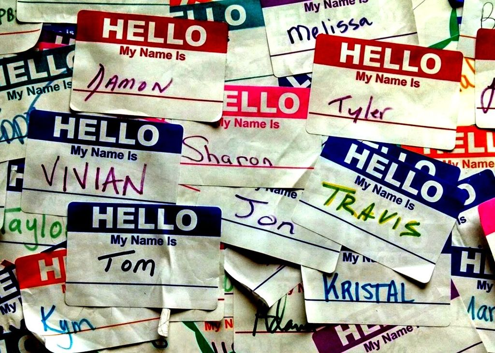

 

# Analyzing American Baby Name Trends

How have American baby name tastes changed since 1920? Which names have remained popular for over 100 years, and how do those names compare to more recent top baby names? These are considerations for many new parents, but the skills I'll practice while answering these queries are broadly applicable. After all, understanding trends and popularity is important for many businesses, too!

I'll be working with data provided by the United States Social Security Administration, which lists first names along with the number and sex of babies they were given to in each year. For processing speed purposes, I've limited the dataset to first names which were given to over 5,000 American babies in a given year. Data spans 101 years, from 1920 through 2020.

### `baby_names`

| column                             | type    | meaning                                              |
|------------------------------------|---------|------------------------------------------------------|
| `year`                             |`INT`    | year                                                 |
| `first_name`                       |`VARCHAR`| first name                                           |
| `sex`                              |`VARCHAR`| sex of babies given first_name                       |
| `num`                              |`INT`    | number of babies of sex given first_name in that year|
